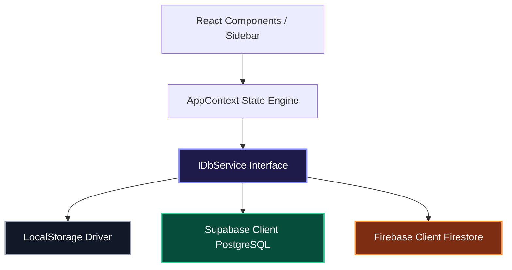

# 🪐 Aether Todo: Premium Glassmorphic Productivity Suite

Aether Todo is a state-of-the-art, visually stunning React & TypeScript productivity suite designed to marry beautiful modern glassmorphic aesthetics with robust cloud database synchronization. 

Equipped with a **flexible database adapter pattern**, a custom **Pomodoro focus engine**, dynamic **accent theme customization**, and a fully automated **local-to-cloud sync/migration layer**, Aether Todo represents a premium tier of web application development.

---

## 🎨 Premium Visual Architecture

The application is built on top of a carefully curated modern UI design system featuring:
*   **Vibrant Glassmorphism:** Deep translucent backgrounds, multi-layered backdrop filters, and subtle, neon-hued high-contrast borders.
*   **Adaptive Theme System:** Instantly toggle between five gorgeous accent flavors—`indigo`, `emerald`, `rose`, `amber`, and `cyan`—under both deep dark-mode and pristine light-mode templates.
*   **Interactive Motion & Micro-Animations:** Responsive click states, active pulse badges reflecting sync status, and smooth element transitions.
*   **High-Fidelity Components:** Embedded Pomodoro visual timer, tactile subtask trackers, calendar-based due dates, and tag chips.

---

## 📖 User Guide: How to Use Aether Todo

Follow this operational guide to get the most out of Aether Todo's premium productivity and focus tools.

### 1. 🗂️ Managing & Organizing Tasks
*   **Creating a Task:** Click the **"+ Add Task"** button in the sidebar or press the <kbd>N</kbd> key. In the premium glassmorphic modal:
    *   Set a descriptive **Title** and optional **Description**.
    *   Set the **Priority** to `Low`, `Medium`, or `High` (each color-coded to fit your visual accent).
    *   Assign a **Due Date** via the calendar selector to keep track of deadlines.
    *   Type and press Enter to append search-friendly **Tags**.
    *   Estimate the number of **Pomodoro focus sessions** needed to complete the task.
*   **Checking off Subtasks:** Expand task details, type a subtask title, and click **Add** to segment complex objectives. Check them off individually as you progress.
*   **Filtering Tasks:** Use the left Sidebar to focus:
    *   **All:** View all active objectives.
    *   **Today / Upcoming:** Dynamically filter tasks due on the current day or in the future.
    *   **Completed:** Review your completed items.
    *   **Category Tag Lists:** Click any custom tag in the sidebar lists to filter tasks by project tags immediately.

### 2. ⏱️ Mastering the Pomodoro Focus Engine
Each task has an integrated visual Pomodoro controller:
*   **Initiate Focus:** Click the **Timer icon** on any task item. The beautiful glassmorphic Timer widget will slide into view.
*   **Operate the Countdown:**
    *   Click **Start** to begin a standard 25-minute focus sequence.
    *   **Pause** at any time if interrupted, or **Reset** the session.
    *   A micro-visual progress ring dynamically fills as the countdown progresses.
*   **Complete & Auto-Log:** Once the countdown hits zero, a success sound chimes, a dynamic success toast is triggered, and your task's **Completed Pomodoro** count increments by 1 automatically! 
*   **Short Breaks:** Utilize the 5-minute break timer to rest before the next focus cycle.

### 3. 🎨 Customizing the App Aesthetic
Make the workspace fit your energy:
*   Click the **Theme Customizer** palette icon in the sidebar (or press <kbd>P</kbd>).
*   **Accent Color:** Select from one of five premium glowing highlights:
    *   `Indigo` (Royal electric)
    *   `Emerald` (Clean organic green)
    *   `Rose` (Punchy crimson)
    *   `Amber` (Warm productivity gold)
    *   `Cyan` (Futuristic neon blue)
*   **Chroma Mode:** Switch between a pristine **Light Glass** or a deep **Dark Glass** template. All backdrops, shadows, and borders adapt gracefully.

### 4. ☁️ Linking Your Database & Syncing Accounts
To back up your data and sync it across multiple machines:
1.  **Check Connection Badge:** Observe the status badge in the bottom-left corner of the Sidebar.
2.  **Input Cloud Details:** Click the badge to open the **Cloud Setup Modal**.
    *   Select your provider (**Supabase** or **Firebase**).
    *   Input credentials manually, or **paste the raw configuration snippet** from your Google console to let the auto-parser handle configuration setup instantly.
    *   Click **Save & Establish Link**. The sidebar status dot will turn yellow/green representing cloud readiness.
3.  **Create / Sign In to Sync Account:** Move to the **Sync Account** tab. Log in or create a new email/password account.
4.  **Instant Migration:** If you created tasks locally before connecting, Aether Todo will detect them and show an **Offline Data Detected** banner. Click **Migrate Local Data to Cloud** to securely upload all your existing offline items to your user record in under a second!

---

## 🔌 Database Adapter Pattern (Architecture)

Aether Todo utilizes a strict **Unified Database Adapter Pattern** defined in [`db.ts`](file:///c:/Users/jathi/Downloads/Antigravity_Projects/todo-app/src/services/db.ts). The application is decoupled from backend-specific database drivers, allowing plug-and-play functionality across different database providers.



### Dynamic Switcher & Initialization
1.  **Fallback-by-Default:** If no cloud configuration exists, the application operates locally using the robust `LocalStorage` driver, keeping the app 100% functional offline.
2.  **Environment Setup:** Developers can specify environment variables (`.env`) to lock in a cloud database globally.
3.  **Runtime Override:** Standard users can click the sidebar connection status badge to open the Cloud Setup Modal and paste custom Supabase or Firebase configurations directly. The UI will instantly disconnect from the old database and hot-reload the new provider dynamically without refreshing the page!

---

## 💾 Cloud Setup & Schemas

Aether Todo is fully compatible with both **Supabase** and **Firebase**. Below are the exact steps and schemas required to bootstrap your backend instances in under 5 minutes.

---

### 🟢 Method 1: Supabase Setup (Recommended)

Supabase provides an open-source Firebase alternative backed by PostgreSQL. The data is mapped between PostgreSQL's standard `snake_case` and TypeScript's `camelCase` inside [`db.ts`](file:///c:/Users/jathi/Downloads/Antigravity_Projects/todo-app/src/services/db.ts) automatically.

#### 1. SQL Table Schema
Create a table named `tasks` in your Supabase SQL Editor:

```sql
-- 1. Create the base tasks table
CREATE TABLE IF NOT EXISTS public.tasks (
    id TEXT PRIMARY KEY,
    user_id UUID NOT NULL REFERENCES auth.users(id) ON DELETE CASCADE,
    title TEXT NOT NULL,
    description TEXT,
    completed BOOLEAN NOT NULL DEFAULT false,
    priority TEXT NOT NULL CHECK (priority IN ('low', 'medium', 'high')),
    due_date TEXT, -- Stored as ISO string YYYY-MM-DD
    tags TEXT[] NOT NULL DEFAULT '{}',
    subtasks JSONB NOT NULL DEFAULT '[]'::jsonb,
    estimated_pomodoros INTEGER NOT NULL DEFAULT 1,
    completed_pomodoros INTEGER NOT NULL DEFAULT 0,
    reminder BOOLEAN NOT NULL DEFAULT false,
    created_at TIMESTAMPTZ NOT NULL DEFAULT NOW(),
    updated_at TIMESTAMPTZ NOT NULL DEFAULT NOW()
);

-- 2. Enable Row Level Security (RLS)
ALTER TABLE public.tasks ENABLE ROW LEVEL SECURITY;

-- 3. Create isolation policies
CREATE POLICY "Users can create their own tasks" 
ON public.tasks 
FOR INSERT 
WITH CHECK (auth.uid() = user_id);

CREATE POLICY "Users can view their own tasks" 
ON public.tasks 
FOR SELECT 
USING (auth.uid() = user_id);

CREATE POLICY "Users can update their own tasks" 
ON public.tasks 
FOR UPDATE 
USING (auth.uid() = user_id)
WITH CHECK (auth.uid() = user_id);

CREATE POLICY "Users can delete their own tasks" 
ON public.tasks 
FOR DELETE 
USING (auth.uid() = user_id);
```

#### 2. Get Credentials
*   Go to **Project Settings** -> **API**.
*   Copy your **Project URL** and your **anon public** key.
*   Paste them into the app's database settings modal, or set them in `.env`:
    ```env
    VITE_SUPABASE_URL=your_supabase_project_url
    VITE_SUPABASE_ANON_KEY=your_supabase_anon_public_key
    ```

---

### 🔥 Method 2: Firebase Setup

Firebase Firestore offers a real-time, unstructured document database. 

#### 1. Firestore Security Rules
Go to your **Firestore Database** -> **Rules** tab, and publish the following configuration to ensure user data isolation:

```javascript
rules_version = '2';
service cloud.firestore {
  match /databases/{database}/documents {
    match /tasks/{taskId} {
      // Require authentication and ensure users can only see/modify their own tasks
      allow read, update, delete: if request.auth != null && resource.data.userId == request.auth.uid;
      allow create: if request.auth != null && request.resource.data.userId == request.auth.uid;
    }
  }
}
```

#### 2. Get Credentials
*   Go to **Project Settings** -> **General** -> **Your apps**.
*   Select Web App (or register one) and copy the `firebaseConfig` block.
*   Paste it directly into the Cloud Configuration Modal. The **auto-config paste engine** will automatically parse it, extract individual JSON properties, and initialize Firestore. Alternatively, append it to your `.env` file:
    ```env
    VITE_FIREBASE_API_KEY=your_api_key
    VITE_FIREBASE_AUTH_DOMAIN=your_auth_domain
    VITE_FIREBASE_PROJECT_ID=your_project_id
    VITE_FIREBASE_STORAGE_BUCKET=your_storage_bucket
    VITE_FIREBASE_MESSAGING_SENDER_ID=your_messaging_sender_id
    VITE_FIREBASE_APP_ID=your_app_id
    ```

---

## ⚡ Asynchronous State & One-Click Bulk Sync

The state synchronization engine is powered by [`AppContext.tsx`](file:///c:/Users/jathi/Downloads/Antigravity_Projects/todo-app/src/context/AppContext.tsx). It features a zero-friction **Data Migration Utility**:

*   **Offline First:** Start immediately! Create tasks, prioritize them, set subtasks, and track Pomodoro focus blocks directly on your local device.
*   **One-Click Migration:** The second you sign up or log in to a cloud provider (Supabase or Firebase), Aether Todo detects if you have existing local tasks and asks if you would like to migrate them. 
*   **Safe Upsert:** Clicking "Sync Tasks" runs a secure, multi-row bulk injection transaction on the cloud, mapping all your legacy offline items to your authenticated user account. Once completed, your database status changes to **Sync Connected** and transitions fully to live network synchronization.

---

## ⌨️ Keyboard Commands & Global Hotkeys

For high-speed power users, Aether Todo includes a global keyboard layout listener at [`useKeyboardShortcuts.ts`](file:///c:/Users/jathi/Downloads/Antigravity_Projects/todo-app/src/hooks/useKeyboardShortcuts.ts) that bypasses interactive textareas and inputs:

| Shortcut | Description | Location / Action |
| :--- | :--- | :--- |
| <kbd>N</kbd> / <kbd>n</kbd> | **New Task Modal** | Opens the creation modal for immediate task entries |
| <kbd>P</kbd> / <kbd>p</kbd> | **Theme Customizer** | Toggles the visual accent drawer on the right side |
| <kbd>Esc</kbd> | **Close Active Overlays** | Gracefully dismisses any open modal or theme customizing sidebar |

---

## 📂 Project Architecture & Granular Sub-Documentation

For a complete deep-dive understanding of every single custom element, state lifecycle, and npm dependency in the Aether Todo codebase, we have established a dedicated **[`docs/`](file:///c:/Users/jathi/Downloads/Antigravity_Projects/todo-app/docs/)** repository. Click any document below to explore:

*   **📖 Component Reference Guide — [`architecture_and_components.md`](file:///c:/Users/jathi/Downloads/Antigravity_Projects/todo-app/docs/architecture_and_components.md)**: Absolute visual and operational documentation for all 12 React components, structural state variables, visual timers, and CSS glassmorphic tokens.
*   **📖 State & Database Mappings — [`data_and_state.md`](file:///c:/Users/jathi/Downloads/Antigravity_Projects/todo-app/docs/data_and_state.md)**: Highly detailed analysis of TypeScript definitions, mapping parameters (PostgreSQL snake_case translation to TS camelCase), Firestore data structures, authentication triggers, and local data migration flows.
*   **📖 Core Ecosystem & Dev Tools — [`tools_and_dependencies.md`](file:///c:/Users/jathi/Downloads/Antigravity_Projects/todo-app/docs/tools_and_dependencies.md)**: Full library audit detailing exact packages (React 19, Vite 8, TypeScript 6, Supabase-js, Firebase SDK, Framer Motion, ESLint configurations).

### Workspace Directory Layout

```markdown
├── 📁 docs/                   # 📖 Granular Sub-Documentation Center
│   ├── 📄 architecture_and_components.md
│   ├── 📄 data_and_state.md
│   └── 📄 tools_and_dependencies.md
│
├── 📁 public/                 # Static web assets & icons
└── 📁 src/
    ├── 📄 main.tsx            # React application bootstrapper
    ├── 📄 App.tsx             # Root frame container
    ├── 📄 index.css           # Premium styling, animations, and typography variables
    ├── 📄 types.ts            # Global TypeScript model definitions
    ├── 📄 env.d.ts            # Environment type mappings
    │
    ├── 📁 context/
    │   └── 📄 AppContext.tsx  # Central sync-engine & user authentication state
    │
    ├── 📁 services/
    │   └── 📄 db.ts           # Dynamic Database Adapter (LocalStorage / Supabase / Firebase)
    │
    ├── 📁 hooks/
    │   └── 📄 useKeyboardShortcuts.ts # Global input-safe keyboard keyboard hook listener
    │
    ├── 📁 utils/
    │   └── 📄 dummyData.ts    # Seed tasks for visual testing
    │
    └── 📁 components/         # High-fidelity visual components
        ├── 📄 Layout.tsx      # Sidebar & content wrapper layout grid
        ├── 📄 Sidebar.tsx     # Navigation & visual live-pulsing connection badge
        ├── 📄 Header.tsx      # Filter controllers, user profile, & search queries
        ├── 📄 Dashboard.tsx   # Visual statistics grids, compliance rates, & metrics
        ├── 📄 TaskList.tsx    # Drag-friendly responsive list container
        ├── 📄 TaskItem.tsx    # Comprehensive task widget with Pomodoro controls
        ├── 📄 TaskModal.tsx   # Detailed subtask & metadata editor
        ├── 📄 PomodoroTimer.tsx # Immersive countdown focus widget
        ├── 📄 ThemeCustomizer.tsx # Slider & selector accent skin configurator
        ├── 📄 CloudConfigModal.tsx # Multi-provider cloud credential manager & parser
        └── 📄 ToastContainer.tsx # Glassmorphic visual micro-notifications layer
```

---

## 🛠️ Local Development & Setup

Follow these simple steps to spin up the developer repository locally.

### Prerequisites
*   Node.js (v18 or higher recommended)
*   npm or yarn

### Installation
1. Clone the repository and navigate to the directory:
   ```bash
   cd todo-app
   ```
2. Install the production and developer dependencies:
   ```bash
   npm install
   ```
3. Boot up the Vite local development HMR server:
   ```bash
   npm run dev
   ```
4. Access the premium suite in your browser at `http://localhost:5173`.

### Production Build
To bundle the assets, optimize JS files, and compile the final, minimized output folder:
```bash
npm run build
```
The optimized bundle will be compiled inside the `dist/` directory, ready to be hosted on Vercel, Netlify, or Firebase Hosting.

---

## 🪐 Developer Statement

Designed and engineered with absolute attention to pixel alignment, logical separation of concerns, and clean responsive interfaces. Enjoy unparalleled task management and focus control with **Aether Todo**.

