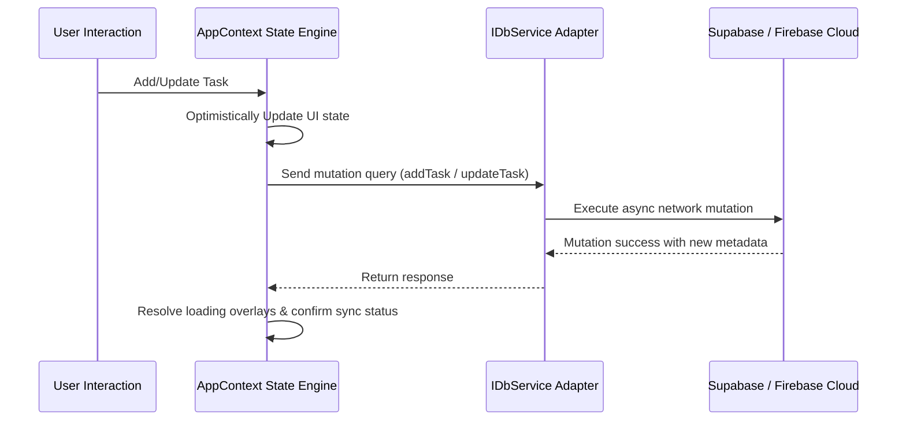

# 💾 Data Engine, Database Adapters & State Lifecycle

This document provides a highly detailed walkthrough of the **Aether Todo** state engine, database abstraction layers, mapping filters, and authentication state lifecycles.

---

## 🗃️ Type Schema Definitions

All TypeScript models are strictly defined in [`types.ts`](file:///c:/Users/jathi/Downloads/Antigravity_Projects/todo-app/src/types.ts).

### 1. The Core `Task` Schema
A task represents a rich object carrying metadata, Pomodoro metrics, and subtask arrays:

```typescript
export interface SubTask {
  id: string;
  title: string;
  completed: boolean;
}

export type Priority = 'low' | 'medium' | 'high';

export interface Task {
  id: string;
  title: string;
  description?: string;
  completed: boolean;
  priority: Priority;
  dueDate?: string; // YYYY-MM-DD format
  tags: string[];
  subtasks: SubTask[];
  estimatedPomodoros: number;
  completedPomodoros: number;
  reminder?: boolean;
  createdAt: string;
  updatedAt: string;
}
```

### 2. Configuration Schemas
Used for binding state configurations:
*   `SortConfig`: Defines `field` (`dueDate` | `priority` | `title` | `createdAt`) and `order` (`asc` | `desc`).
*   `AccentTheme`: Defines visual accent colors (`indigo` | `emerald` | `rose` | `amber` | `cyan`).
*   `ThemeMode`: Represents screen template modes (`light` | `dark`).

---

## 🔌 Unified Database Service Layer

All direct mutations or selections are decoupled from individual components using the **Database Service Pattern** at [`db.ts`](file:///c:/Users/jathi/Downloads/Antigravity_Projects/todo-app/src/services/db.ts).

### 1. The `IDbService` Interface
Every driver implementation conforms to a standardized asynchronous contract:
```typescript
export interface IDbService {
  name: 'supabase' | 'firebase' | 'local';
  getTasks(userId?: string): Promise<Task[]>;
  addTask(task: Omit<Task, 'id' | 'createdAt' | 'updatedAt'>, userId?: string): Promise<Task>;
  updateTask(id: string, updates: Partial<Task>): Promise<Task>;
  deleteTask(id: string): Promise<void>;
  bulkAddTasks(tasks: Task[], userId?: string): Promise<void>;
}
```

---

### 2. Provider Driver Implementations

#### A. 🗄️ Local Storage Service (`LocalStorageService`)
*   **Target Backend:** Browser memory `window.localStorage`.
*   **Behavior:** 
    *   Serializes and deserializes the entire task list to the JSON string `'todo_app_tasks'`.
    *   Generates client-side unique identifiers (e.g. `task-xxxxxxx` using random 36-base string conversion) and stamps local ISO-8601 creation/update dates.
    *   Returns empty arrays gracefully on parse failures or first visits.

#### B. 🟢 Supabase Cloud Service (`SupabaseService`)
*   **Target Backend:** Supabase PostgreSQL.
*   **Mapping Transformations:** PostgreSQL enforces strict `snake_case` naming rules for columns, whereas React utilizes `camelCase`. `db.ts` houses specialized conversion functions:
    *   `mapTaskFromDb(dbTask: any): Task`
    *   `mapTaskToDb(task: Partial<Task>, userId?: string): any`
*   **Data Structures:** 
    *   `tags` are stored as native PostgreSQL text arrays (`text[]`).
    *   `subtasks` are mapped into a single, high-performance PostgreSQL `jsonb` array of objects, ensuring atomic state reads.
    *   `user_id` binds the row to the active Supabase Auth user UUID.

#### C. 🔥 Firebase Cloud Service (`FirebaseService`)
*   **Target Backend:** Google Firestore.
*   **Structure:**
    *   Tasks are written as individual documents inside the `tasks` root collection.
    *   The task ID matches the document reference ID.
    *   Each task document includes a standard `userId` field matching the authenticated Firebase user.
    *   Batched operations (`writeBatch()`) are used to execute multi-row bulk insertions transactionally.

---

### 3. Dynamic Factory Loader
The file implements a dynamic factory config loader and service generator:
*   `getStoredDbConfig()`: Automatically checks high-priority development environment variables (`import.meta.env`) first. If absent, it queries `localStorage` to check if a user has configured custom runtime credentials.
*   `createDbService(config: DbConfig)`: Constructs and returns the selected backend driver instance. If errors occur during cloud configuration, it catches them and falls back to `LocalStorageService` to prevent app failure.

---

## ⚡ Asynchronous State Lifecycle Engine

The main application state is managed at the top level by [`AppContext.tsx`](file:///c:/Users/jathi/Downloads/Antigravity_Projects/todo-app/src/context/AppContext.tsx) using React's Context API.



### 1. State Lifecycle Steps
1.  **Boot Phase:** On page render, the provider calls `getStoredDbConfig()`, initializes the active `db` adapter, and requests active authentication sessions.
2.  **Fetch Phase:** If a session is active, tasks are fetched asynchronously using `db.getTasks(userId)`. If offline, tasks are read instantly from the browser's storage.
3.  **Authentication Hooks:** 
    *   Listen to Auth states dynamically.
    *   When the user signs out, memory is wiped, all tasks are flushed, and the adapter resets to local storage.
4.  **Local-to-Cloud Migration Routine:**
    *   During authentication, the app checks if `localStorage` contains legacy tasks created while offline.
    *   If offline tasks exist, the state engine opens a migration modal.
    *   Upon approval, `db.bulkAddTasks(localTasks, authenticatedUserId)` is called, transferring the offline data to the cloud. The local cache is then cleaned up.
